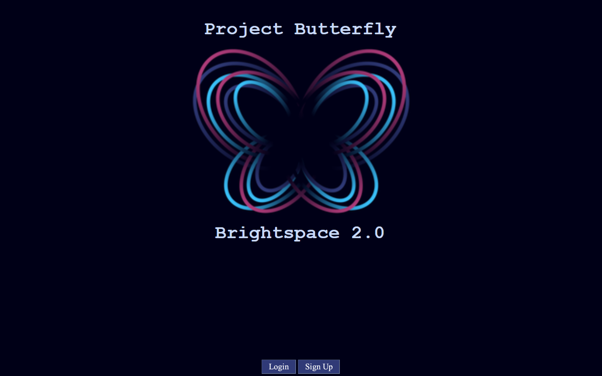
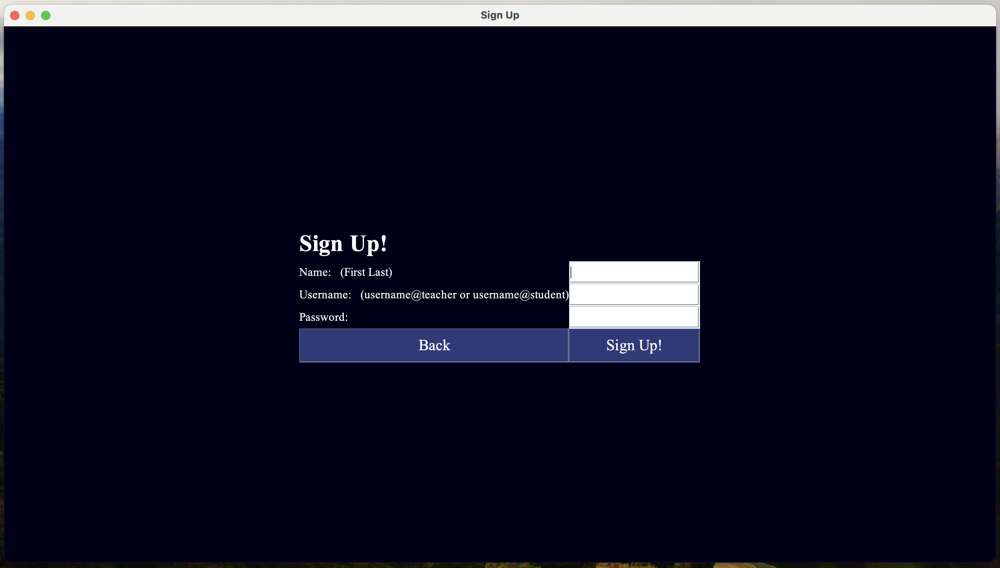
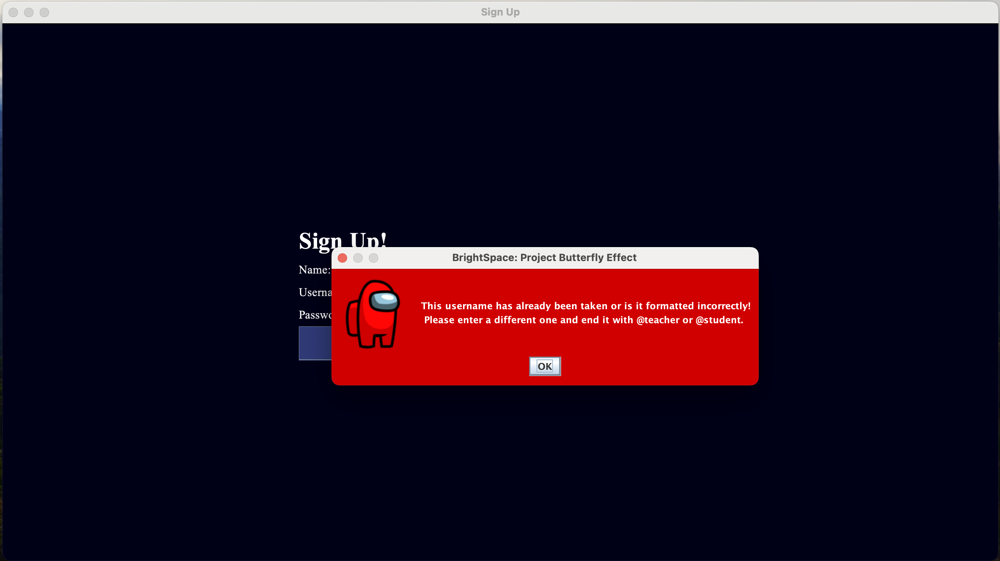
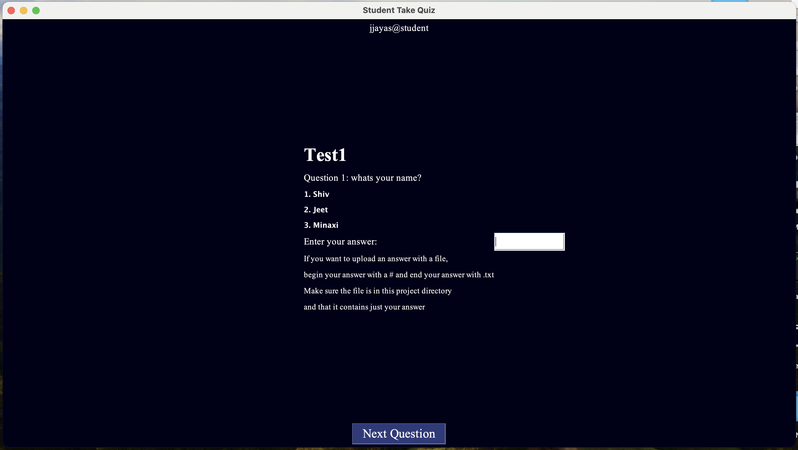
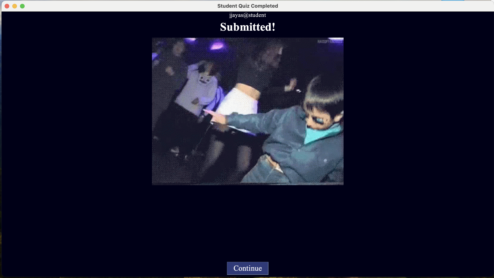
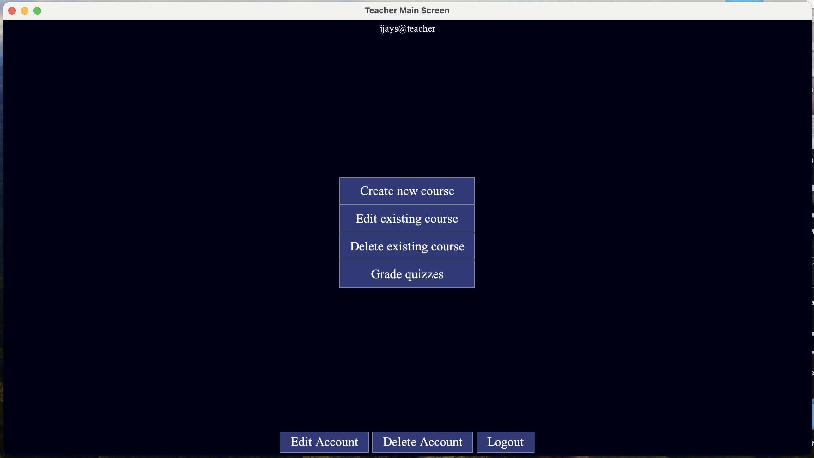
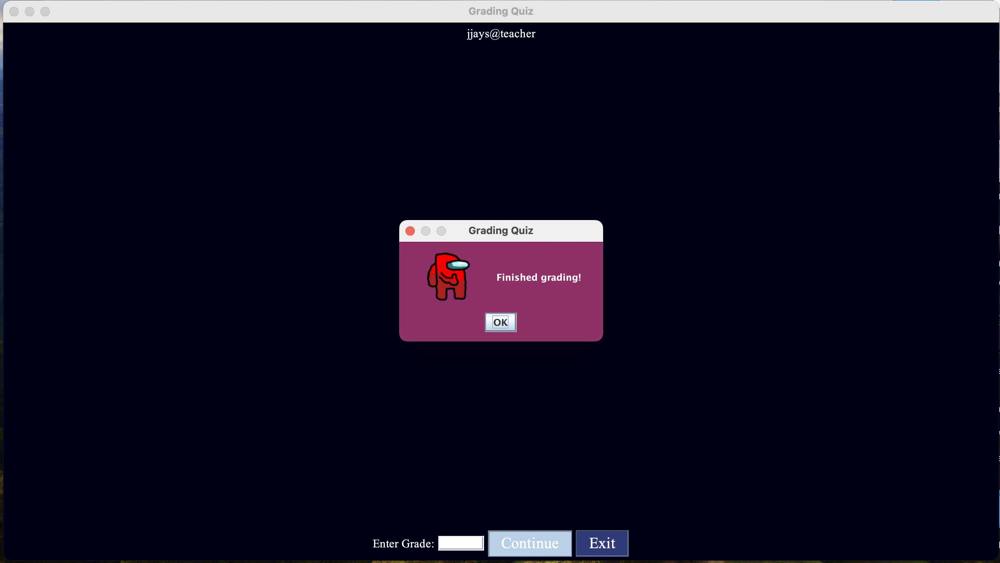
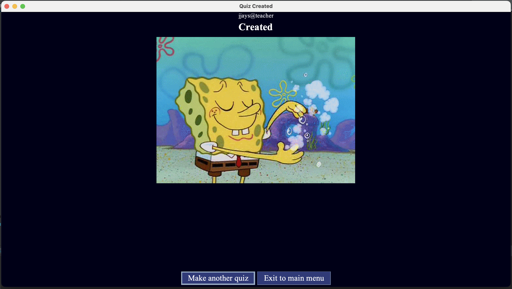

# BrightSpace 2.0 

Welcome to **BrightSpace 2.0**, a comprehensive Learning Management System (LMS) designed to streamline the process of creating, administering, and grading quizzes. This application offers both teachers and students a seamless experience for managing courses and quizzes.

## 🚀 Features

### User Roles

**Teachers:**
- Create, edit, and manage courses.
- Develop quizzes with multiple-choice questions and advanced options.
- View and grade student submissions with detailed feedback.

**Students:**
- Access available courses and quizzes.
- Submit quiz responses, with the ability to attach files.
- View graded quizzes with detailed scoring.

### Courses & Quizzes

- **Multiple Courses:** Teachers can create unlimited courses, each containing multiple quizzes.
- **Persistent Data:** User data and quiz results are saved, ensuring that information is retained even after disconnection.
- **User Management:** Secure account creation and login with unique identifiers.

### Quiz Functionality

- **Quiz Creation:** Teachers can design quizzes with multiple-choice questions, with options for randomization.
- **Student Interaction:** Students can attempt quizzes, submit responses, and attach files as needed.
- **Grading:** Teachers can manually grade quizzes and provide detailed scoring for each question.

### Advanced Features

- **File Imports:** Teachers can easily import quizzes via file uploads, streamlining the quiz creation process.
- **Randomization:** Quiz questions and options can be randomized for each student attempt.
- **Enhanced Question Types:** Beyond multiple-choice, teachers can add fill-in-the-blank, dropdown, matching, and true/false questions.

### Optional Features

- **Question Pools:** Teachers can create a pool of questions, with a random subset selected for each quiz attempt.
- **Custom Access:** Teachers can offer extended deadlines and additional time to specific students.

### Application Screenshots

Here’s how **QuizMaster LMS** looks while it’s running:
  
  
  
  
  
  
  
  

## 🔧 Getting Started

1. **Account Creation:** Users must sign up or log in to access the application. 
2. **Role Selection:** During account creation, select your role as either Teacher or Student.
3. **Course Management:** Teachers can begin creating courses and quizzes immediately. Students can access and attempt quizzes as they become available.

## 🛠 Technical Specifications

- **Persistent Data Storage:** Ensures all user data and quiz results are stored securely.
- **Error Handling:** Descriptive error messages ensure smooth user experience, avoiding crashes.
- **User Authentication:** Secure login and unique identifiers for each user.

## 🧠 Example Use Case

For a practical example, think of **Brightspace quizzes**—QuizMaster LMS is designed to offer a similar, user-friendly interface with robust features to support both teaching and learning.

## 📥 File Import Instructions

- **Quiz Import:** Teachers can import quizzes by entering the file path when prompted.
- **File Attachments:** Students can attach files to quiz responses, enabling a richer submission process.

## 🎓 Conclusion

**QuizMaster LMS** is built to provide a robust, flexible, and user-friendly platform for managing quizzes in an educational environment. Whether you’re a teacher creating content or a student taking quizzes, QuizMaster LMS has the tools you need to succeed.
